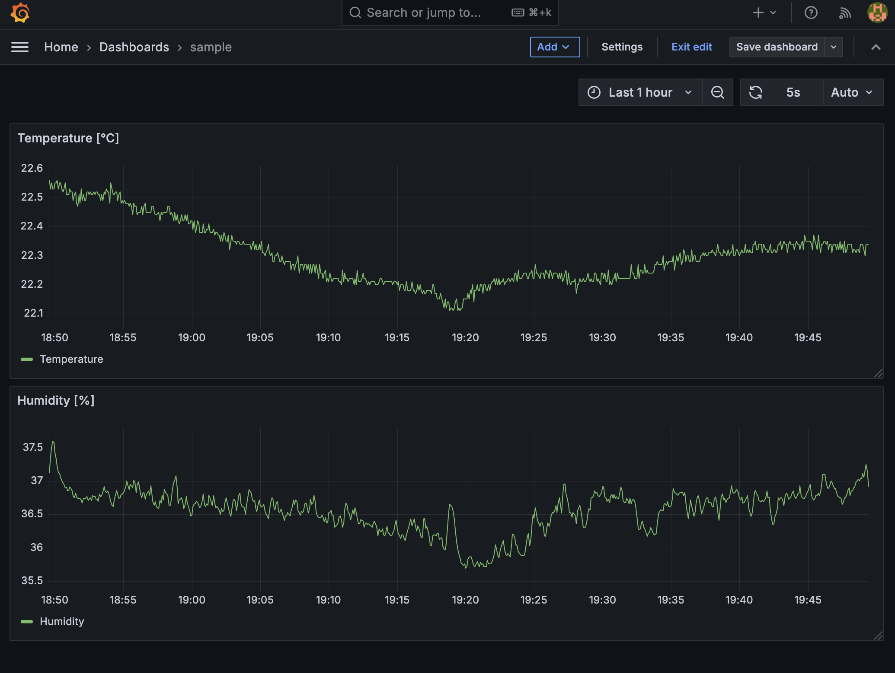

# 温湿度監視ツール

部屋の温度と湿度を取得して、InfluxDBにアップロードします。
Grafanaと連携することで、リアルタイムに監視することができます。



必要な環境

- ESP32 Devkit
- SHT31 (温湿度センサ)
  - I2Cで通信します
- サーバー
  - Python 3
  - InfluxDB (2.x)
  - Grafana (optional, 可視化用)
 

構成

1. ESP32
  - SHT31温湿度センサのデータを取得し、WiFi経由でデータの入ったUDPパケットをサーバーに送信
  - プログラムはPlatformIOで書き込む
2. サーバー
  - UDPでESP32からデータを受信
  - データをInfluxDBに書き込む
3. InfluxDB
  - センサーデータを保存
4. Grafana
  - InfluxDBからデータを取得して可視化

# Usage

## ESP32

WiFiを使用するので、あらかじめ環境変数を設定しておきます。 ( `.bashrc` や `.zshrc` に追加してください。)

```shell
export WIFI_SSID="SSID"
export WIFI_PASSWORD="PASSWORD"
```

Visual Studio Codeで `esp-iot-dev` ディレクトリを開き、Platform IOからコンパイル、ESP32にファームウェアの書き込みをします。


## サーバー側

InfluxDBに必要な環境変数を設定します。ここでは、InfluxDB 2.xがインストールされていて、 `localhost:8086` でアプリケーションが動作していることを前提としています。

```shell
export INFLUXDB_URL="http://localhost:8086"
export INFLUXDB_TOKEN="your_token"
export INFLUXDB_ORG="your_organization"
export INFLUXDB_BUCKET="your_bucket"
```

また、このプロジェクトでは将来性からuvを使用しています。

```shell
uv sync
```

```
uv run udp_to_influx.py
```


3000ポートからGrafanaにアクセスします。

[http://localhost:3000](http://localhost:3000)


自分の環境では次のクエリをdashboardに追加しています。

温度

```flux
from(bucket: "esp-iot")
  |> range(start: v.timeRangeStart, stop: v.timeRangeStop)
  |> filter(fn: (r) => r["_measurement"] == "sensor_data")
  |> filter(fn: (r) => r["_field"] == "Temperature")
  |> aggregateWindow(every: v.windowPeriod, fn: mean, createEmpty: false)
  |> yield(name: "mean")
```

湿度

```flux
from(bucket: "esp-iot")
  |> range(start: v.timeRangeStart, stop: v.timeRangeStop)
  |> filter(fn: (r) => r["_measurement"] == "sensor_data")
  |> filter(fn: (r) => r["_field"] == "Humidity")
  |> aggregateWindow(every: v.windowPeriod, fn: mean, createEmpty: false)
  |> yield(name: "mean")
```


# 著者

Yuma Ochi
